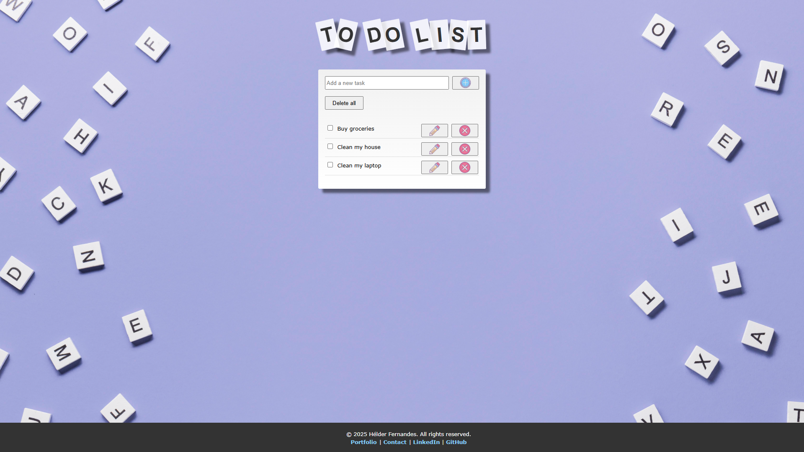

# Todo App

A simple and lightweight **To-Do List App** built with **HTML, CSS, and JavaScript**. This app allows users to add, edit, delete, and mark tasks as completed.

## 🚀 Features
- Add new tasks
- Edit existing tasks
- Mark tasks as completed
- Delete tasks
- Data stored in local storage (persists after refresh)

## 📦 Installation & Usage
1. **Clone the Repository**
   ```sh
   git clone https://github.com/YOUR-USERNAME/todo-app.git
   ```
2. **Navigate to the Project Folder**
   ```sh
   cd todo-app
   ```
3. **Run a Local Server**
   Since the app requires a local server, you can start one using Python:
   ```sh
   # For Python 3
   python -m http.server 8000
   ```
   or using Node.js:
   ```sh
   npx serve
   ```
4. **Open in Browser**
   - Open `http://localhost:8000` (or the port assigned) in your preferred web browser.

## 📸 Screenshots
<div align="left">
   <a href="https://helderhub.github.io/todo-app" target="_blank">
      
   </a> 
</div>

## 🌍 Live Demo

<div align="left" style="color:white;">
   <a href="https://helderhub.github.io/todo-app" target="_blank">View the Live Demo Here
   </a>
</div>

## ⭐ Don't forget to **star** this repo if you found it useful!

